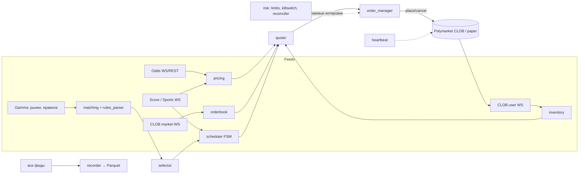
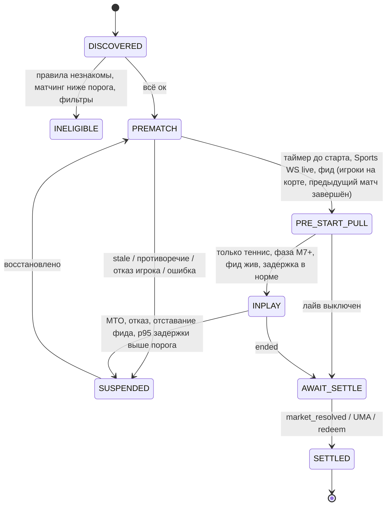

# Архитектура (итог M0)

> Предложение для утверждения. Код начинается с M1 только после вашего «ок».
> Факты об API взяты из `docs/api_notes.md`, про источники данных — из `docs/data_sources.md`.

## 1. Принципы

1. **Одна стратегия для backtest, paper, shadow и live.** Меняются только адаптеры: источник событий (реплей или живые фиды) и исполнитель (симулятор или биржа).
2. **Событийная модель.** Все входы (книга, сделки, коэффициенты, счёт, таймеры) превращаются в типизированные события на внутренней шине. Стратегия — чистая функция `(состояние, событие) → (новое состояние, желаемые котировки)`. Поэтому её можно детерминированно реплеить и тестировать.
3. **Fail-closed.** В любой непонятной ситуации (устаревшие данные, рассинхрон, незнакомые правила, ошибки API) бот снимает котировки, а не «угадывает».
4. **Правила и константы читаются из API.** Тик, комиссия, задержка, награды и время старта берутся с конкретного рынка. В конфиге — только наши параметры стратегии и риска.
5. **Несколько слоёв защиты ордеров** (сверху вниз):
   - наш `PRE_START_PULL` и отмена на каждое событие счёта;
   - GTD-экспирация прематч-котировок не позже `gameStartTime`;
   - авто-отмена биржей на старте матча;
   - heartbeat dead-man switch: биржа сама снимет всё через 10–15 с, если процесс умер;
   - kill-switch;
   - `cancel_all` при каждом старте и штатной остановке бота.
6. **Живые деньги — только при `LIVE_TRADING=true` в `.env` и явном подтверждении в чате.** По умолчанию режим `paper`.

## 2. Карта модулей

`[+]` — добавлено относительно промта, `[~]` — изменено, остальное как в промте.

```
src/
  core/
    config.py            # pydantic-settings; режимы paper | shadow | live; LIVE_TRADING-гейт
    clock.py             # монотонное время + UTC; контроль дрейфа (chrony) и лага фидов
    events.py            # шина событий (asyncio.Queue fan-out), типы событий
    ids.py           [+] # типы ConditionId/TokenId/OrderKey, генерация идемпотентных ключей
  venues/polymarket/
    sdk.py           [+] # единая точка импорта polymarket-client (пин версии, фабрика клиентов)
    gamma.py             # рынки/события/теги, description (правила), sportsMarketType, gameStartTime
    clob_rest.py         # ордера/отмены/позиции/баланс поверх SDK; разбор режимов 425/503/post-only
    clob_ws.py       [~] # СВОЙ тонкий WS-клиент market+user: сырые кадры с ts_recv, PING/PONG, ресинк
    sports_ws.py     [+] # Polymarket Sports WS: детектор старта/конца, сверка счёта
    orderbook.py         # L2-книга: снапшот+дельты, проверка hash/кроссинга, резинк по REST /book
    heartbeat.py     [+] # POST /v1/heartbeats каждые ~5 с; сбой → kill-switch
    rate_budget.py   [+] # token-bucket бюджет ордеров/отмен по заголовкам Poly-RateLimit*
    rewards.py           # параметры наград, order-scoring, оценка ожидаемой награды
    fees.py          [+] # feeSchedule рынка, формула C·r·(p(1−p))^e, ожидаемый ребейт
    ctf.py           [~] # split/merge/redeem через SDK (collateral adapters, relayer); pUSD
    geoblock.py      [+] # проверка /api/geoblock при старте и периодически
  feeds/
    odds/
      base.py            # OddsProvider: снапшоты/апдейты с source, bookmaker, ts_source, ts_recv
      betfair.py     [+] # Betfair Exchange Stream API (если доступен по юрисдикции)
      oddspapi.py    [+] # агрегатор с Pinnacle/Betfair (WS)
      the_odds_api.py    # вторичный: сверка консенсуса, CLV по крупным событиям
      # pinnacle.py  [-] # удалён: публичный API закрыт с 2025-07-23
    scores/
      base.py            # ScoreProvider: нормализованные события очко/гейм/сет/MTO/отказ
      tennis_live.py     # платный point-by-point фид (выбор на M7 по замерам)
  matching/
    event_matcher.py     # рынок ↔ событие букмекера ↔ матч в фиде счёта (fuzzy + YAML-оверрайды)
    rules_parser.py      # description → класс правил (walkover=50-50, retirement=advancing, …)
  pricing/
    devig.py             # multiplicative, power, Shin; консенсус с весами
    rules_adjust.py  [+] # перевод no-vig вероятностей букмекера в вероятность по правилам Polymarket
    fair_value.py        # FairValueProvider, композиция по фазе/спорту, confidence, staleness
    prematch.py
    tennis_markov.py     # очко → гейм → тай-брейк → сет → матч, DP с мемоизацией, форматы турниров
    tennis_calib.py      # обратная задача p_a, p_b из прематч-цены; байес-апдейт в лайве
  strategy/
    quoter.py            # reservation price, полуспред, размеры, тики, requote-порог, награды
    inventory.py         # позиции (pending/confirmed), скос, агрегирование по событию (neg-risk)
    taker.py             # тейкер с учётом secondsDelay, комиссии и буфера задержки
    scheduler.py         # FSM жизненного цикла рынка
    selector.py      [+] # отбор рынков: объём, глубина, правила, уверенность матчинга, награды/риск
  risk/
    limits.py
    killswitch.py
    reconciler.py        # сверка ордеров/позиций/баланса с биржей каждые N с
  execution/
    order_manager.py     # диффы котировок → минимальные place/cancel, батчи ≤15, идемпотентность
    paper.py             # симулятор исполнения (очередь L2, частичные, задержки, delay-фаза)
  data/
    recorder.py          # сырые кадры всех фидов → Parquet (партиции date/source), ротация
    storage.py           # SQLite WAL: ордера, сделки, позиции, PnL, fair-снапшоты, инциденты
  analytics/
    markout.py, clv.py, pnl_attribution.py, gates.py [+], report.py
  backtest/
    replay.py            # реплей Parquet через ту же стратегию и тот же OrderManager
    fill_model.py        # очередь (FIFO-оценка по L2), латентность, delay-фаза тейкеров
  ops/
    telegram_bot.py, healthcheck.py, main.py
config/                  # base.yaml, sports/*.yaml, overrides/matching.yaml, risk.yaml
tests/                   # unit, property (hypothesis), integration (записанные WS-сессии), chaos
docs/                    # api_notes, data_sources, architecture, risks, capacity, plan, strategy, runbook
```

Почему WS — свой клиент, а REST, подписи и CTF — через SDK:
- SDK ведёт нормализованные потоки, но рекордеру нужны **сырые кадры с точным временем получения**;
- стратегии нужен контроль ресинка и замер задержек в горячем пути;
- подпись ордеров, аутентификация, split/merge и протоколы V2/v3 меняются, их корректнее держать в официальном SDK, пинить версию и закрывать контрактными тестами.

## 3. Потоки данных



## 4. Справедливая цена

### 4.1 Прематч
1. **Снятие маржи** по каждому букмекеру: multiplicative, power, Shin. Метод по умолчанию: power или Shin для 2 исходов (теннис), Shin для 3 исходов (футбол 1X2).
2. **Консенсус:** взвешенное среднее в логит-пространстве. Веса: острые (Betfair Ex, Pinnacle) высокие, мягкие низкие или исключены.
3. **`confidence` ∈ [0, 1]** — функция от числа источников, их разброса (MAD в логитах) и свежести. Низкая уверенность расширяет спред; ниже порога рынок не котируется.
4. **Устаревание: `stale_ms` зависит от времени до старта.** За сутки линии двигаются медленно, за 30 минут до старта — быстро. Правило: `stale_ms(τ) = clamp(a + b·τ, min, max)`. Котировать ближе `near_start_window` к старту можно только с push-источником (WS или Stream).
5. **Перевод в правила Polymarket** (`rules_adjust.py`). Правила тенниса на polymarket.com: walkover или отмена → 50-50, снятие после начала → проходящий игрок.
   - Если у букмекера **walkover = void**, а **retirement = проходящий** (как на Betfair):
     `P_pm(A) = (1 − p_wo)·q + 0.5·p_wo`
   - Если у букмекера **retirement = void**, то `q = P(A | матч доигран)`, и
     `P(A | матч начат) = q·(1 − r_A − r_B) + r_B`

     где `p_wo`, `r_A`, `r_B` — априорные вероятности walkover и снятия. На старте берутся из конфига, потом оцениваются по записанным данным.
   - Эффект обычно 0.1–1 цента. Этого достаточно, чтобы быть систематически неправым при спреде в 1–2 тика.
6. **Футбол:** из 3 исходов Shin даёт `P(H)`, `P(D)`, `P(A)`. Каждый бинарный рынок Polymarket («Победит ли H?» и т.д.) получает свою вероятность. Инвентарь агрегируется по событию.

### 4.2 Лайв-теннис (Марковская модель)
- **Модель.** `p_a`, `p_b` — вероятность выиграть очко на своей подаче. Дальше аналитически или через DP с мемоизацией: гейм (с deuce), тай-брейк (7 и 10 очков), сет, матч.
  - Формат задаётся турниром: best-of-3/5, тай-брейк в решающем сете, супер-тай-брейк в парном разряде.
  - Состояние: `(сеты, геймы, очки, подающий, флаг тай-брейка)`.
- **Калибровка.** Прематч-вероятность P после `rules_adjust` в модели должна воспроизводиться на старте. Фиксируем сумму `p_a + p_b` по приору (тур × покрытие; если есть рынок тотала геймов — по нему) и решаем одномерную задачу по разности бисекцией (монотонность).
- **Байес в лайве.** Beta-приоры на `p_a` и `p_b` с сильной массой `n0` (сотни очков-эквивалентов), обновление по фактически разыгранным очкам.
- **Бленд:** `fair = w·model + (1 − w)·live_devig`, веса в конфиге.
- **Тесты:**
  - симметрия `P(A; p_a, p_b) = 1 − P(B; p_b, p_a)`;
  - монотонность по `p_a` и по счёту;
  - граничные случаи (p → 0 или 1);
  - сверка с Монте-Карло (100k симуляций, допуск 3σ);
  - сверка с известными таблицами (Newton & Keller).

### 4.3 Интерфейс
```python
class FairQuote(BaseModel):
    market_id: str; token_id: str
    prob: float            # вероятность исхода токена по правилам Polymarket
    confidence: float      # 0..1
    ts: int                # ns, время расчёта; ts_inputs — время самого старого входа
    source: str            # "prematch:consensus" | "tennis:markov+live" | ...
    stale: bool

class FairValueProvider(Protocol):
    async def fair(self, market_id: str) -> FairQuote | None: ...
```

## 5. Котировщик и исполнение

- **Reservation price** (Avellaneda–Stoikov для бинарного контракта): `r = fair − q·γ·σ²·τ`.
  - `σ` — оценка волатильности fair (EWMA по приращениям логита, переведённая в пространство вероятностей);
  - `τ` — время до `PRE_START_PULL` (прематч) или до конца (лайв).
- **Полуспред:** `δ = max(min_edge, k·σ·√τ_h) + conf_penalty(confidence)`, где `τ_h` — горизонт удержания.
  - **Поправка к промту.** Условие наград — это *верхняя* граница: чтобы попасть в награды, нужно `δ ≤ v` (`rewardsMaxSpread`). Если `δ_risk > v`, есть два пути: котировать с `δ_risk` вне наград или сузиться до `v`. Выбираем по сравнению ожидаемой награды и ожидаемого дополнительного adverse selection (`rewards.py`).
- **Размеры:** `base_size × liq_factor × skew(q)`. Сторона, увеличивающая инвентарь, уменьшается вплоть до нуля на лимите. Если размер ниже `rewardsMinSize`, котировка в наградах не учитывается.
- **Тики и кроссинг.** Bid округляется вниз, ask вверх. Всегда `bid < best_ask` и `ask > best_bid`. Только **post-only** (GTC или GTD).
- **Requote-порог.** Котировку переставляем, если `|Δr| > requote_threshold`, или она вышла из допустимого коридора, или сработал риск-триггер. Иначе держим место в очереди.
- **Split/merge.** Вместо покупки NO держим пары YES+NO (split) и продаём из инвентаря. Излишки пар в конце дня сливаем обратно в pUSD (merge). Всё через SDK.
- **OrderManager:**
  - считает дифф «желаемое против фактического» → минимальный набор операций; отмены приоритетнее выставлений;
  - батчи до 15 ордеров, бюджет токенов `rate_budget`;
  - идемпотентность по ключу `(market, token, side, level, version)`: при неизвестном исходе запроса сначала сверка через `/data/orders`, потом повтор;
  - обработка `delayed`, `unmatched`, `INVALID_ORDER_DUPLICATED`;
  - режимы биржи 425/503/post-only переводят ОМС в `DEGRADED` (только отмены).
- **Тейкер** (`taker.py`, только после M7). Бьём в книгу, если `|fair − best| > taker_threshold + fee(p) + buffer(secondsDelay)` и уверенность высокая. `buffer` — квантиль изменения fair за `secondsDelay` при текущем состоянии матча: наш ордер ~3 с нельзя отменить. Размер ограничен отдельным лимитом.

## 6. Жизненный цикл рынка



- **Старт в теннисе.** Время матча «после предыдущего» — оценка, матч может начаться раньше. Поэтому `PRE_START_PULL` срабатывает по самому раннему из сигналов: расписание, Sports WS (`live=true`), завершение предыдущего матча на том же корте (из фида счёта). Сверх этого действуют GTD-экспирация и авто-отмена биржей.
- **INPLAY:** на каждое событие счёта `cancel_market_orders(market)`, потом пересчёт, потом новые котировки. Логируем цепочку `ts_event_feed → ts_cancel_sent → ts_cancel_ack(user WS)`. Если p95 > порога, лайв по этому источнику выключается автоматически.

## 7. Риск

- **Лимиты:** позиция на рынок, на событие, на вид спорта; общий нотионал; число открытых ордеров; максимальный размер ордера. Дневной лимит убытка и просадка от пика → стоп и алерт.
- **Kill-switch** срабатывает на:
  - устаревшую fair-цену;
  - рассинхрон книги (hash или кроссинг, перепроверка по REST);
  - больше N ошибок API в минуту;
  - расхождение при сверке;
  - потерю WS;
  - аномальный markout;
  - сбой heartbeat;
  - дрейф часов больше порога;
  - geoblock ≠ ok.
- **Reconciler** раз в N секунд сверяет открытые ордера, позиции (с учётом статусов `MATCHED`/`CONFIRMED`/`FAILED`) и баланс pUSD. Любое расхождение → пауза и алерт.
- Мартингейла и усреднения против движения нет.

## 8. Данные

- **Рекордер (с первого дня M1, отдельный контейнер):**
  - сырые кадры market, user и sports WS, фидов коэффициентов и счёта; у каждого кадра `ts_recv_ns`, `source`, `conn_id`, `seq`;
  - периодические REST-снапшоты книг для валидации;
  - снапшоты Gamma: рынки, `description`, награды, комиссии, `gameStartTime`;
  - Parquet с партициями `date=/source=`, почасовая ротация, zstd.
- **Хранилище:** SQLite WAL — ордера, сделки, позиции, PnL, fair-снапшоты, инциденты, версии конфига. Переход на Postgres не должен требовать менять слой выше `storage.py`.

## 9. Режимы

| Режим | Фиды | Исполнитель | Назначение |
|---|---|---|---|
| backtest | Реплей Parquet | `fill_model` | Гейт «Backtest» |
| paper | Живые | `paper.py`: очередь по L2, частичные исполнения, задержка | Проверка всей цепочки |
| shadow | Живые | Нет; котировки и гипотетические исполнения против фактических сделок | Markout без риска |
| live | Живые | Биржа | Только при `LIVE_TRADING=true` и подтверждении в чате |

## 10. Деплой

- Разработка на Windows (uvloop не используется), прод — Linux VPS, Docker Compose. Сервисы: `recorder` (всегда включён), `bot`, `telegram` (внутри bot).
- Регион VPS: разрешённая юрисдикция и минимальный замеренный RTT до CLOB (по сторонним измерениям — AWS eu-west-2).
- Часы: chrony. Секреты: `.env` вне образа, приватный ключ не логируется. Вариант M6 — session key со скоупом `CLOB`, чтобы мастер-ключ не лежал на VPS.

## 11. Отклонения от промта и их обоснование

| # | В промте | Решение | Почему |
|---|---|---|---|
| 1 | «Официальный Python-клиент CLOB» | `polymarket-client` 0.11.x (официальный объединённый SDK) с пином точной версии; heartbeat — своим L2-вызовом; WS — свой тонкий клиент | `py-clob-client` мёртв после V2. `py-clob-client-v2` сам рекомендует новый SDK. В SDK 0.x возможны breaking-изменения. Рекордеру нужны сырые кадры |
| 2 | USDC, CTF split/merge | Залог **pUSD**; split/merge/redeem через SDK (collateral adapters, relayer); поддержка рынков protocol v2 (`exchange_v3`) | Так устроен V2 и «Poly V2 identifiers» (2026-09) |
| 3 | `the_odds_api.py` — основной, `pinnacle.py` | Основной — Betfair Stream (если доступен) или OddsPapi WS; The Odds API — вторичный; `pinnacle.py` удалён | Публичный API Pinnacle закрыт с 2025-07-23. The Odds API не покрывает Challenger/ITF и отдаёт прематч с задержкой до 2 мин |
| 4 | `stale_ms` ≈ 30 с | `stale_ms` зависит от времени до старта; у старта котируем только при push-источнике | Иначе с поллинговым источником котировок не будет почти никогда, или они будут устаревшими |
| 5 | PRE_START_PULL по таймеру | Самый ранний из сигналов (таймер, Sports WS, фид); плюс GTD ≤ старта, авто-отмена биржи, heartbeat | Теннисные матчи начинаются раньше расчётного времени; нужна многослойная защита |
| 6 | Лайв: cancel на событие | То же, плюс учёт `secondsDelay` (~3 с): окно для отмены мейкера, и неотменяемый риск тейкера учитывается в пороге | Подтверждённое поведение спортивных рынков |
| 7 | — | `heartbeat.py` (dead-man switch) | Защищает, если процесс или VPS умер |
| 8 | — | Обработка режимов биржи (425 / 503 cancel-only / 2 мин post-only) | Документированное поведение рестартов |
| 9 | Rate limiting | `rate_budget.py` по token bucket с тирами; отмены приоритетнее | Схема 2026 года: батч допускается только целиком |
| 10 | Разложение PnL: спред / награды / инвентарь / отбор / комиссии | Добавлена отдельная строка **мейкер-ребейты** | В спорте ребейт 15% тейкер-комиссий, это заметная часть edge |
| 11 | Полуспред `max(…, rewards_max_spread_constraint)` | Условие наград — верхняя граница (`δ ≤ v`); выбор по ожидаемой ценности | Иначе формула мешает попасть в награды |
| 12 | Перевод в вероятность «по правилам» | Явный модуль `rules_adjust.py` (walkover 50-50, retirement) | Правила Polymarket и букмекеров различаются, ошибка 0.1–1 цент систематическая |
| 13 | — | `geoblock.py` — жёсткий гейт | Комплаенс; обход запрещён ToS |
| 14 | M1 «как можно раньше» | Рекордер сразу на VPS | Облачное окружение разработки не пускает на хосты Polymarket |
| 15 | Paper ≥7 дн, затем Shadow ≥7 дн | Paper и Shadow — один процесс, два выхода, ≥10 дней параллельно; гейты те же | Этапы почти совпадают по вычислениям; экономия около недели без потери контроля |
| 16 | Теннис + футбол | Старт: теннис moneyline ATP/WTA и Challenger; футбол 1X2 топ-лиг. ITF исключён; сеты и тоталы — на M8 | ITF: тонкие рынки, повышенный риск инсайда. Сеты и тоталы оцениваются той же Марковской моделью |
