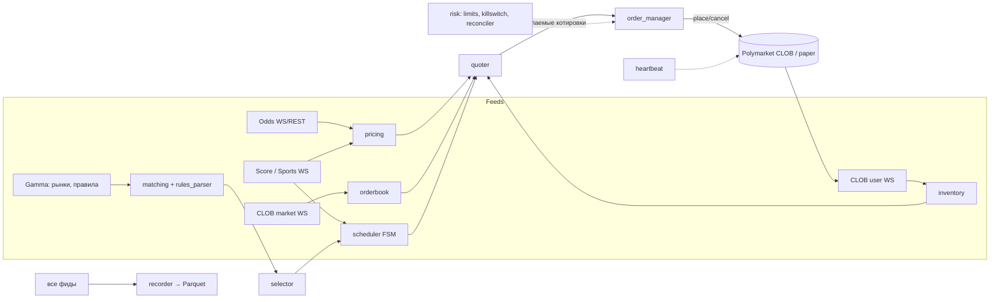
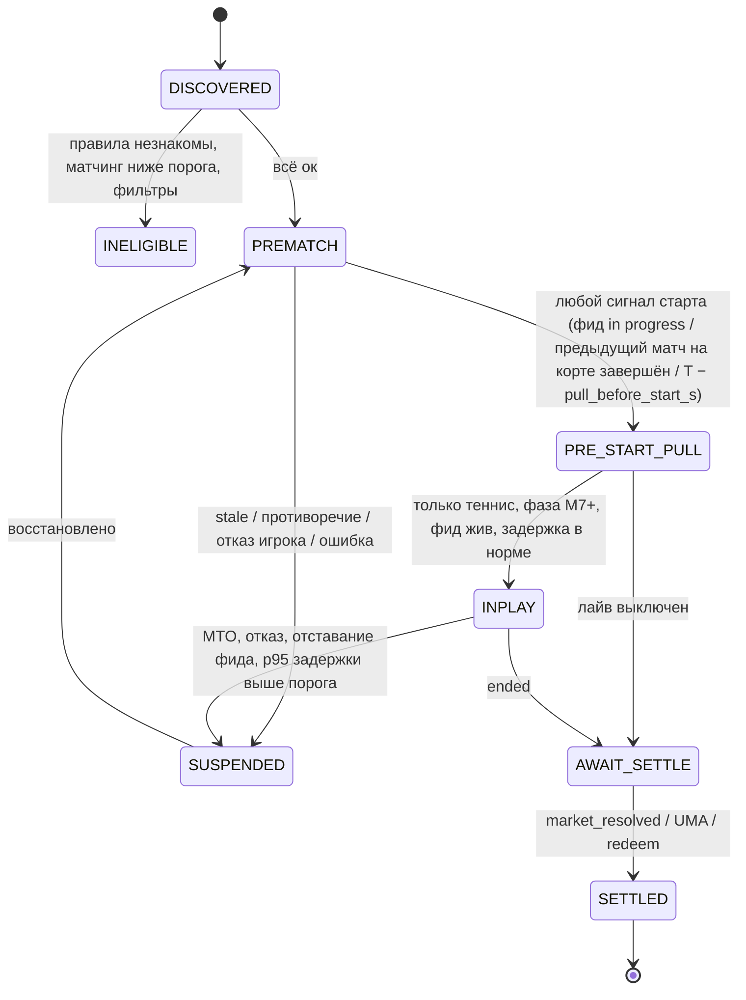

# Архитектура

> Утверждена 2026-09-25 вместе с решениями пользователя (`docs/plan.md`). M1 (рекордер и замеры) реализован в `src/polybot`.
> Факты об API взяты из `docs/api_notes.md`, про источники данных — из `docs/data_sources.md`.

## 1. Принципы

1. **Одна стратегия для backtest, paper, shadow и live.** Меняются только адаптеры: источник событий (реплей или живые фиды) и исполнитель (симулятор или биржа).
2. **Событийная модель.** Все входы (книга, сделки, коэффициенты, счёт, таймеры) превращаются в типизированные события на внутренней шине. Стратегия — чистая функция `(состояние, событие) → (новое состояние, желаемые котировки)`. Поэтому её можно детерминированно реплеить и тестировать.
3. **Fail-closed.** В любой непонятной ситуации (устаревшие данные, рассинхрон, незнакомые правила, ошибки API) бот снимает котировки, а не «угадывает».
4. **Правила и константы читаются из API.** Тик, комиссия, задержка, награды и время старта берутся с конкретного рынка. В конфиге — только наши параметры стратегии и риска.
5. **Несколько слоёв защиты ордеров** (сверху вниз):
   - наш `PRE_START_PULL` и отмена на каждое событие счёта;
   - GTD-экспирация прематч-котировок не позже `gameStartTime`;
   - авто-отмена биржей на старте матча;
   - heartbeat dead-man switch: биржа сама снимет всё через 10–15 с, если процесс умер;
   - kill-switch;
   - `cancel_all` при каждом старте и штатной остановке бота.
6. **Живые деньги — только при `LIVE_TRADING=true` в `.env` и явном подтверждении в чате.** По умолчанию режим `paper`.

## 2. Карта модулей

Пакет — `src/polybot`. `✓` — реализовано в M1, `[+]` — добавлено относительно промта, `[~]` — изменено, остальное как в промте.

```
src/polybot/
  __main__.py          ✓ # CLI: record, geocheck, discover, netcheck, latency, oddspapi-eval, report, compact, health
  core/
    config.py          ✓ # pydantic-settings (.env) + config/*.yaml; LIVE_TRADING-гейт
    logging.py         ✓ # structlog JSON; маскировка всего, что похоже на ключ
    timeutil.py        ✓ # int ns UTC; парсер времён Gamma/OddsPapi (наивные даты отвергаются)
    http.py            ✓ # httpx с замером задержки
    ws.py              ✓ # свой WS-клиент: сырые кадры + ts_recv_ns, PING/PONG, реконнект
    clock.py             # контроль дрейфа часов (chrony) в рантайме — M4
    events.py, ids.py    # шина событий, идентификаторы — M4
  venues/
    base.py        [+] ✓ # площадко-нейтральный контракт для стратегии (§12)
    polymarket/
      geoblock.py  [+] ✓ # гейт при старте и периодически
      gamma.py         ✓ # теги, /sports, /events/keyset
      markets.py       ✓ # разбор событий и рынков Gamma
      clob_ws.py   [~] ✓ # пул market channel: ≤200 активов/соединение, ресинк
      sports_ws.py [+] ✓ # Sports WS
      orderbook.py     ✓ # L2-книга, проверки по best_bid/ask и REST hash
      clob_rest.py     ✓ # публичные чтения; ордера и отмены — M4
      sdk.py, heartbeat.py, rate_budget.py, rewards.py, fees.py, ctf.py   # M4+
    polymarket_us/       # фаза масштабирования (§12)
  feeds/
    odds/
      oddspapi.py  [+] ✓ # REST с бюджетом запросов, сырой WS
      oddspapi_models.py ✓ # разбор матчей и цен
      # the_odds_api.py  — отложен (решение 2); betfair.py — не используем (решение 2)
    scores/              # платный поочковый фид — только по решению 5 (M7)
  matching/
    event_matcher.py   ✓ # v0: Betradar id → fuzzy с отказом; полная версия — M2
    names.py, tournaments.py ✓
    rules_parser.py      # M2
  recorder/        [+] ✓ # app (оркестрация), discovery, rest_tasks, oddspapi_task, health
  data/
    records.py, sink.py, store.py ✓ # единая схема строк, Parquet date=/source=, DuckDB-чтение
    storage.py           # SQLite WAL — M4
  analytics/
    m1_report.py   [+] ✓ # отчёт по неделе записи
    oddspapi_quality.py ✓ # покрытие, цены острых букмекеров, задержка, точность сопоставления
    loaders.py, stats.py ✓
    markout.py, clv.py, pnl_attribution.py, gates.py [+], report.py   # M4–M6
  ops/             [+] ✓ # netcheck, latency, discover, oddspapi_eval (инструменты VPS)
  pricing/  strategy/  risk/  execution/  backtest/     # M3–M5, после отчёта M1
config/                ✓ # base.yaml, recorder.yaml
tests/                 ✓ # unit, property (hypothesis), WS против локального сервера, сквозной отчёт
```

Почему WS — свой клиент, а REST, подписи и CTF — через SDK:
- SDK ведёт нормализованные потоки, но рекордеру нужны **сырые кадры с точным временем получения**;
- стратегии нужен контроль ресинка и замер задержек в горячем пути;
- подпись ордеров, аутентификация, split/merge и протоколы V2/v3 меняются, их корректнее держать в официальном SDK, пинить версию и закрывать контрактными тестами.

## 3. Потоки данных



## 4. Справедливая цена

### 4.0 Этап 0: без внешней справедливой цены (решение 7)

Платные данные не покупаем, пока стратегия не принесёт прибыль. Поэтому первая версия котирует от самой книги Polymarket, а консенсус букмекеров (§4.1) включается на этапе 1 по триггерам (`docs/data_sources.md` §7). Переключение — заменой `FairValueProvider` (§4.3), котировщик не меняется.

- **Цена:** микропрайс (середина, взвешенная по объёмам лучших уровней) и её EWMA. Резкие скачки без сделок не принимаются сразу: цена обновляется с лагом, а котировки на это время снимаются.
- **`confidence`** — из ширины спреда, глубины у лучших уровней, стабильности середины за окно и свежести книги. Низкая уверенность — рынок не котируется.
- **Где котируем:** только далеко от старта. Порог — по отчёту M1: где спреды шире, а информированного потока меньше, условно больше 6–24 ч. Широкий спред, малый размер, жёсткий лимит позиции. Котировки снимаются при резком движении середины и по правилу раннего старта (§6).
- **Доход** — награды за ликвидность и ребейты мейкера, а не информационное преимущество. Отбор рынков (`selector`) ставит вперёд рынки с наградами. Условие наград `δ ≤ rewardsMaxSpread` (§5) здесь — основной ограничитель спреда.
- **Контроль по Pinnacle** (бесплатный OddsPapi, раз в день). Если середина Polymarket дальше порога от вероятности Pinnacle без маржи и после поправки на правила (`rules_adjust`), рынок не котируется до следующего контроля.
- **Главный риск** — информированные тейкеры: у них линия уже сдвинулась, у нас ещё нет (риски F1, F7). Поэтому этап 0 проходит те же гейты: бэктест с наградами, paper/shadow, Live-S. Отрицательный markout — сигнал покупать данные (триггер 3), а не расширять капитал.

### 4.1 Прематч (этап 1: консенсус букмекеров)
1. **Снятие маржи** по каждому букмекеру: multiplicative, power, Shin. Метод по умолчанию: power или Shin для 2 исходов (теннис, баскетбол moneyline), Shin для 3 исходов (футбол 1X2). Для баскетбола правила овертайма берутся из `description` рынка.
2. **Консенсус:** взвешенное среднее в логит-пространстве. Веса: острые (Betfair Ex, Pinnacle) высокие, мягкие низкие или исключены.
3. **`confidence` ∈ [0, 1]** — функция от числа источников, их разброса (MAD в логитах) и свежести. Низкая уверенность расширяет спред; ниже порога рынок не котируется.
4. **Устаревание: `stale_ms` зависит от времени до старта.** За сутки линии двигаются медленно, за 30 минут до старта — быстро. Правило: `stale_ms(τ) = clamp(a + b·τ, min, max)`. Котировать ближе `near_start_window` к старту можно только с push-источником (WS или Stream).
5. **Перевод в правила Polymarket** (`rules_adjust.py`). Правила тенниса на polymarket.com: walkover или отмена → 50-50, снятие после начала → проходящий игрок.
   - Если у букмекера **walkover = void**, а **retirement = проходящий** (как на Betfair):
     `P_pm(A) = (1 − p_wo)·q + 0.5·p_wo`
   - Если у букмекера **retirement = void**, то `q = P(A | матч доигран)`, и
     `P(A | матч начат) = q·(1 − r_A − r_B) + r_B`

     где `p_wo`, `r_A`, `r_B` — априорные вероятности walkover и снятия. На старте берутся из конфига, потом оцениваются по записанным данным.
   - Эффект обычно 0.1–1 цента. Этого достаточно, чтобы быть систематически неправым при спреде в 1–2 тика.
6. **Футбол:** из 3 исходов Shin даёт `P(H)`, `P(D)`, `P(A)`. Каждый бинарный рынок Polymarket («Победит ли H?» и т.д.) получает свою вероятность. Инвентарь агрегируется по событию.

### 4.2 Лайв-теннис (Марковская модель)
- **Модель.** `p_a`, `p_b` — вероятность выиграть очко на своей подаче. Дальше аналитически или через DP с мемоизацией: гейм (с deuce), тай-брейк (7 и 10 очков), сет, матч.
  - Формат задаётся турниром: best-of-3/5, тай-брейк в решающем сете, супер-тай-брейк в парном разряде.
  - Состояние: `(сеты, геймы, очки, подающий, флаг тай-брейка)`.
- **Калибровка.** Прематч-вероятность P после `rules_adjust` в модели должна воспроизводиться на старте. Фиксируем сумму `p_a + p_b` по приору (тур × покрытие; если есть рынок тотала геймов — по нему) и решаем одномерную задачу по разности бисекцией (монотонность).
- **Байес в лайве.** Beta-приоры на `p_a` и `p_b` с сильной массой `n0` (сотни очков-эквивалентов), обновление по фактически разыгранным очкам.
- **Бленд:** `fair = w·model + (1 − w)·live_devig`, веса в конфиге.
- **Тесты:**
  - симметрия `P(A; p_a, p_b) = 1 − P(B; p_b, p_a)`;
  - монотонность по `p_a` и по счёту;
  - граничные случаи (p → 0 или 1);
  - сверка с Монте-Карло (100k симуляций, допуск 3σ);
  - сверка с известными таблицами (Newton & Keller).

### 4.3 Интерфейс
```python
class FairQuote(BaseModel):
    market_id: str; token_id: str
    prob: float            # вероятность исхода токена по правилам Polymarket
    confidence: float      # 0..1
    ts: int                # ns, время расчёта; ts_inputs — время самого старого входа
    source: str            # "prematch:consensus" | "tennis:markov+live" | ...
    stale: bool

class FairValueProvider(Protocol):
    async def fair(self, market_id: str) -> FairQuote | None: ...
```

## 5. Котировщик и исполнение

- **Reservation price** (Avellaneda–Stoikov для бинарного контракта): `r = fair − q·γ·σ²·τ`.
  - `σ` — оценка волатильности fair (EWMA по приращениям логита, переведённая в пространство вероятностей);
  - `τ` — время до `PRE_START_PULL` (прематч) или до конца (лайв).
- **Полуспред:** `δ = max(min_edge, k·σ·√τ_h) + conf_penalty(confidence)`, где `τ_h` — горизонт удержания.
  - **Поправка к промту.** Условие наград — это *верхняя* граница: чтобы попасть в награды, нужно `δ ≤ v` (`rewardsMaxSpread`). Если `δ_risk > v`, есть два пути: котировать с `δ_risk` вне наград или сузиться до `v`. Выбираем по сравнению ожидаемой награды и ожидаемого дополнительного adverse selection (`rewards.py`).
- **Размеры:** `base_size × liq_factor × skew(q)`. Сторона, увеличивающая инвентарь, уменьшается вплоть до нуля на лимите. Если размер ниже `rewardsMinSize`, котировка в наградах не учитывается.
- **Тики и кроссинг.** Bid округляется вниз, ask вверх. Всегда `bid < best_ask` и `ask > best_bid`. Только **post-only** (GTC или GTD).
- **Requote-порог.** Котировку переставляем, если `|Δr| > requote_threshold`, или она вышла из допустимого коридора, или сработал риск-триггер. Иначе держим место в очереди.
- **Split/merge.** Вместо покупки NO держим пары YES+NO (split) и продаём из инвентаря. Излишки пар в конце дня сливаем обратно в pUSD (merge). Всё через SDK.
- **OrderManager:**
  - считает дифф «желаемое против фактического» → минимальный набор операций; отмены приоритетнее выставлений;
  - батчи до 15 ордеров, бюджет токенов `rate_budget`;
  - идемпотентность по ключу `(market, token, side, level, version)`: при неизвестном исходе запроса сначала сверка через `/data/orders`, потом повтор;
  - обработка `delayed`, `unmatched`, `INVALID_ORDER_DUPLICATED`;
  - режимы биржи 425/503/post-only переводят ОМС в `DEGRADED` (только отмены).
- **Тейкер** (`taker.py`, только после M7). Бьём в книгу, если `|fair − best| > taker_threshold + fee(p) + buffer(secondsDelay)` и уверенность высокая. `buffer` — квантиль изменения fair за `secondsDelay` при текущем состоянии матча: наш ордер ~3 с нельзя отменить. Размер ограничен отдельным лимитом.

## 6. Жизненный цикл рынка



- **Защита от раннего старта (решение пользователя 5).** Время матча «после предыдущего» — только оценка, матч может начаться раньше. `PREMATCH → PRE_START_PULL` срабатывает по **любому** из условий, какое наступит первым:
  1. фид показывает, что матч идёт: Sports WS `live=true` / статус «in progress» (или платный фид в M7);
  2. завершился предыдущий матч на том же корте. Данных о кортах пока нет (риск B7), поэтому временно действует консервативная замена: если наш матч «followed by», сигналом служит завершение **любого** матча того же турнира;
  3. наступило `T − pull_before_start_s`, где `T` — последнее известное `gameStartTime`. Значение `pull_before_start_s` выбирается по распределению ранних стартов из отчёта M1 с запасом на задержку сигнала (1).

  На авто-отмену биржи **не полагаемся**. Это нижние, дополнительные слои: GTD-экспирация ≤ `gameStartTime`, авто-отмена на старте, heartbeat. Выход из `PRE_START_PULL` назад в `PREMATCH` не предусмотрен: если сигнал оказался ложным, рынок пропускаем.
  Каждое условие покрывается отдельным тестом в M4. В реплее записанных ранних стартов из M1 после фактического старта не должно оставаться ни одной котировки.
- **INPLAY:** на каждое событие счёта `cancel_market_orders(market)`, потом пересчёт, потом новые котировки. Логируем цепочку `ts_event_feed → ts_cancel_sent → ts_cancel_ack(user WS)`. Если p95 > порога, лайв по этому источнику выключается автоматически.

## 7. Риск

- **Лимиты:** позиция на рынок, на событие, на вид спорта; общий нотионал; число открытых ордеров; максимальный размер ордера. Дневной лимит убытка и просадка от пика → стоп и алерт.
- **Kill-switch** срабатывает на:
  - устаревшую fair-цену;
  - рассинхрон книги (hash или кроссинг, перепроверка по REST);
  - больше N ошибок API в минуту;
  - расхождение при сверке;
  - потерю WS;
  - аномальный markout;
  - сбой heartbeat;
  - дрейф часов больше порога;
  - geoblock ≠ ok.
- **Reconciler** раз в N секунд сверяет открытые ордера, позиции (с учётом статусов `MATCHED`/`CONFIRMED`/`FAILED`) и баланс pUSD. Любое расхождение → пауза и алерт.
- Мартингейла и усреднения против движения нет.

## 8. Данные

- **Рекордер (M1, реализован, контейнер `recorder`):**
  - перед стартом и раз в 10 мин — geoblock-гейт (`venues/polymarket/geoblock.py`);
  - одна схема строк для всех источников (`data/records.py`): `ts_recv_ns`, `run_id`, `seq`, `kind` (frame/rest/control/probe), `conn_id`, `event_type`, `key`, `market`, `asset_id`, `server_ts_ms`, `endpoint`, `status`, `latency_ns`, `payload` — сырой текст как пришёл;
  - Parquet `data/raw/date=YYYY-MM-DD/source=<источник>/part-*.parquet`, zstd. Сброс раз в 30 с через временный файл и `os.replace`, поэтому при аварии теряется не больше одного интервала и не бывает битых файлов. Раз в сутки `polybot compact` сливает части по часам;
  - источники и частота:

    | source | Что | Частота |
    |---|---|---|
    | `gamma_events` | События Gamma по тегам тенниса, футбола и баскетбола: структурные изменения — сразу, полный снапшот — раз в час; `event_gone`, `poll_summary` | опрос раз в 2 мин |
    | `clob_market_ws` | Сырые кадры market channel по moneyline-рынкам с горизонтом 72 ч до старта и 6 ч после; служебные `connected`/`disconnected`/`stale`/`resync`/`desync`; PING→PONG RTT | поток |
    | `clob_rest_books` | `POST /books` пачками по 25 для сверки книг (равенство `hash` → равенство уровней) | раз в 10 с |
    | `clob_markets`, `clob_rewards` | `/clob-markets/{cid}` (тик, комиссия), `/rewards/markets/current` | 6 ч / 1 ч |
    | `sports_ws` | Сырые кадры Sports WS, `key` = `gameId` | поток |
    | `probe_rest` | `GET /time` на CLOB: RTT для `docs/latency.md` | раз в минуту |
    | `oddspapi_rest` / `oddspapi_ws` | Ответы OddsPapi (ключ не пишется) | по плану §6 или режиму `paid_rest`/`ws` |
    | `geoblock`, `recorder` | Вердикт geoblock (IP замаскирован), жизненный цикл и снапшоты здоровья | события |

  - целостность книги: номеров последовательности у биржи нет, поэтому проверки такие — лучшие цены в каждом `price_change`, кроссинг, сравнение с REST при равном `hash`. При сбое — переподписка на актив (биржа присылает свежий `book`);
  - оценка объёма (проверить на VPS): около 1–3 ГБ в сутки после сжатия. Диск в 100 ГБ хватает с запасом на месяц.
- **Хранилище:** SQLite WAL — ордера, сделки, позиции, PnL, fair-снапшоты, инциденты, версии конфига. Переход на Postgres не должен требовать менять слой выше `storage.py`.

## 9. Режимы

| Режим | Фиды | Исполнитель | Назначение |
|---|---|---|---|
| backtest | Реплей Parquet | `fill_model` | Гейт «Backtest» |
| paper | Живые | `paper.py`: очередь по L2, частичные исполнения, задержка | Проверка всей цепочки |
| shadow | Живые | Нет; котировки и гипотетические исполнения против фактических сделок | Markout без риска |
| live | Живые | Биржа | Только при `LIVE_TRADING=true` и подтверждении в чате |

## 10. Деплой

- Разработка на Windows (uvloop не используется), прод — Linux VPS, Docker Compose. Сервисы: `recorder` (M1, всегда включён), `tools` (разовые команды), позже `bot` и `telegram` (внутри bot).
- **VPS — Ереван, Армения (решение 1).** Юрисдикция разрешена по geoblock-гейту. Задержку до CLOB (AWS eu-west-2 за Cloudflare) измеряем на месте: `docs/latency.md`. Инструкция по развёртыванию — `docs/runbook_m1.md`.
- Часы: chrony. Секреты: `.env` вне образа, приватный ключ не логируется. Вариант M6 — session key со скоупом `CLOB`, чтобы мастер-ключ не лежал на VPS.

## 11. Отклонения от промта и их обоснование

| # | В промте | Решение | Почему |
|---|---|---|---|
| 1 | «Официальный Python-клиент CLOB» | `polymarket-client` 0.11.x (официальный объединённый SDK) с пином точной версии; heartbeat — своим L2-вызовом; WS — свой тонкий клиент | `py-clob-client` мёртв после V2. `py-clob-client-v2` сам рекомендует новый SDK. В SDK 0.x возможны breaking-изменения. Рекордеру нужны сырые кадры |
| 2 | USDC, CTF split/merge | Залог **pUSD**; split/merge/redeem через SDK (collateral adapters, relayer); поддержка рынков protocol v2 (`exchange_v3`) | Так устроен V2 и «Poly V2 identifiers» (2026-09) |
| 3 | `the_odds_api.py` — основной, `pinnacle.py` | Основной — OddsPapi после проверки на free/trial; The Odds API отложен; Betfair не используем; `pinnacle.py` удалён | Решение пользователя 2. Публичный API Pinnacle закрыт с 2025-07-23; The Odds API не покрывает Challenger/ITF и отдаёт прематч с задержкой до 2 мин |
| 4 | `stale_ms` ≈ 30 с | `stale_ms` зависит от времени до старта; у старта котируем только при push-источнике | Иначе с поллинговым источником котировок не будет почти никогда, или они будут устаревшими |
| 5 | PRE_START_PULL по таймеру | Самый ранний из сигналов (таймер, Sports WS, фид); плюс GTD ≤ старта, авто-отмена биржи, heartbeat | Теннисные матчи начинаются раньше расчётного времени; нужна многослойная защита |
| 6 | Лайв: cancel на событие | То же, плюс учёт `secondsDelay` (~3 с): окно для отмены мейкера, и неотменяемый риск тейкера учитывается в пороге | Подтверждённое поведение спортивных рынков |
| 7 | — | `heartbeat.py` (dead-man switch) | Защищает, если процесс или VPS умер |
| 8 | — | Обработка режимов биржи (425 / 503 cancel-only / 2 мин post-only) | Документированное поведение рестартов |
| 9 | Rate limiting | `rate_budget.py` по token bucket с тирами; отмены приоритетнее | Схема 2026 года: батч допускается только целиком |
| 10 | Разложение PnL: спред / награды / инвентарь / отбор / комиссии | Добавлена отдельная строка **мейкер-ребейты** | В спорте ребейт 15% тейкер-комиссий, это заметная часть edge |
| 11 | Полуспред `max(…, rewards_max_spread_constraint)` | Условие наград — верхняя граница (`δ ≤ v`); выбор по ожидаемой ценности | Иначе формула мешает попасть в награды |
| 12 | Перевод в вероятность «по правилам» | Явный модуль `rules_adjust.py` (walkover 50-50, retirement) | Правила Polymarket и букмекеров различаются, ошибка 0.1–1 цент систематическая |
| 13 | — | `geoblock.py` — жёсткий гейт | Комплаенс; обход запрещён ToS |
| 14 | M1 «как можно раньше» | Рекордер сразу на VPS | Облачное окружение разработки не пускает на хосты Polymarket |
| 15 | Paper ≥7 дн, затем Shadow ≥7 дн | Paper и Shadow — один процесс, два выхода, ≥10 дней параллельно; гейты те же | Этапы почти совпадают по вычислениям; экономия около недели без потери контроля |
| 16 | Теннис + футбол | Прематч: теннис moneyline ATP/WTA и Challenger, футбол, **баскетбол** (решение 4). ITF — только в записи и оценке ёмкости, не котируется; сеты и тоталы — M8 | Ёмкость для цели; ITF — тонкие рынки и повышенный риск инсайда |
| 17 | — | Контракт площадок `venues/base.py`; стратегия, pricing и risk импортируют только его (проверяется тестом) | Решение 1: Polymarket US добавляется адаптером `venues/polymarket_us/` без изменений стратегии (§12) |
| 18 | — | Сопоставление v0 и отчёт по данным — уже в M1; `mypy --strict` на весь пакет, а не только на pricing/strategy/risk | Отчёт через 7 дней должен показать точность сопоставления; строгие типы дёшевы на старте |
| 19 | — | WS market: шардирование по 200 активов; `custom_feature_enabled` выключен | Лимит подписок не опубликован [3P]; `new_market` приходит по всем рынкам на каждое соединение (дубли ×N), а лучшие цены уже есть в `price_change` |
| 20 | Fair прематча — консенсус острых букмекеров | Этап 0 — справедливая цена из книги Polymarket, котирование далеко от старта, доход от наград и ребейтов; консенсус букмекеров — этап 1 по триггерам (§4.0) | Решение пользователя 7: платные данные — только после прибыли |

## 12. Расширяемость: Polymarket US и другие площадки

**Решение пользователя 1:** Polymarket US (отдельный регулируемый API) — в фазе масштабирования. Требование: добавить `venues/polymarket_us/` без изменений стратегии.

- `venues/base.py` задаёт площадко-нейтральный контракт:
  - `VenueId`, `InstrumentRef` (площадка, рынок, инструмент);
  - `MarketRules` — тик, минимальный размер, задержка тейкера, комиссии, текст правил. Всё это адаптер читает с площадки, в конфиге этих значений нет;
  - `MarketMeta`, `BookSnapshot`, `TradePrint`;
  - протоколы `MarketDataVenue` и `ExecutionVenue` (post-only, `cancel`, `cancel_market`, `cancel_all`).
- Стратегия, pricing и risk видят только эти типы. Тест `tests/test_architecture.py` запрещает им импортировать `venues.polymarket*`.
- Адаптер каждой площадки переводит свой формат в контракт: идентификаторы, цены (на US — свои тики и комиссии), правила резолюции. Правила разбирает `matching/rules_parser.py` по тексту конкретного рынка: на US, например, walkover разрешается по последней справедливой цене, а не 50-50 (`docs/api_notes.md` §12).
- Всё, что зависит от площадки — heartbeat, rate limits, режимы биржи, geoblock, — живёт внутри адаптера. Наружу выходит только состояние «можно / нельзя котировать» и причина.
- Рекордер пишет сырые кадры с `source` конкретной площадки, поэтому данные разных площадок не смешиваются.
